# Creating machine on aws

# Create aws account

You need first of all create a aws account

# Access EC2 and create machine

After creating the account, log in and, in the search menu, select EC2.

After selecting it, go to "instances" side menu and go for "Launch instance" and choose a ubuntu machine

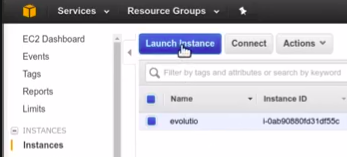

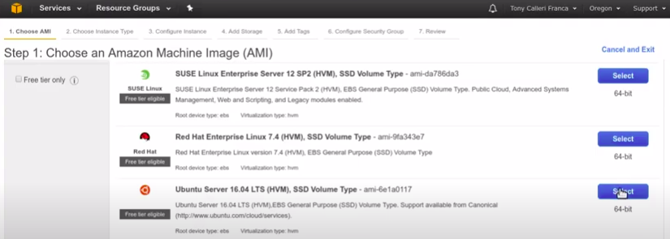

Choose a machine type: micro or nano

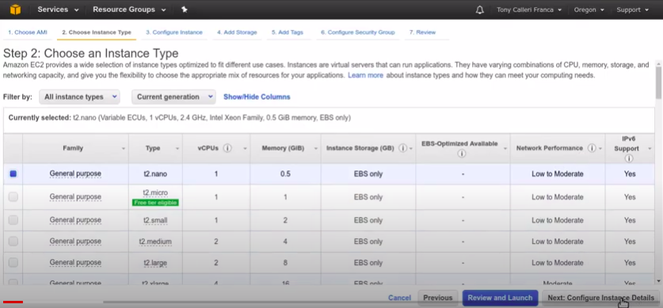

Keep default values

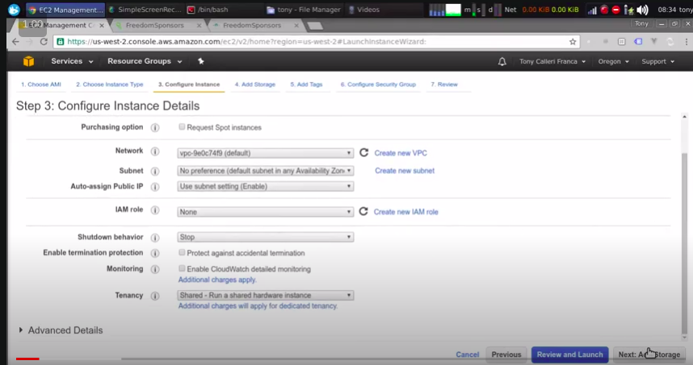

Change instance size to 20gb hard drive

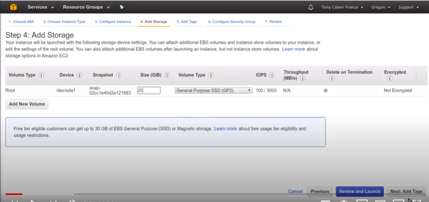

Create tag "Name:tutorial" and select "Review and Launch"

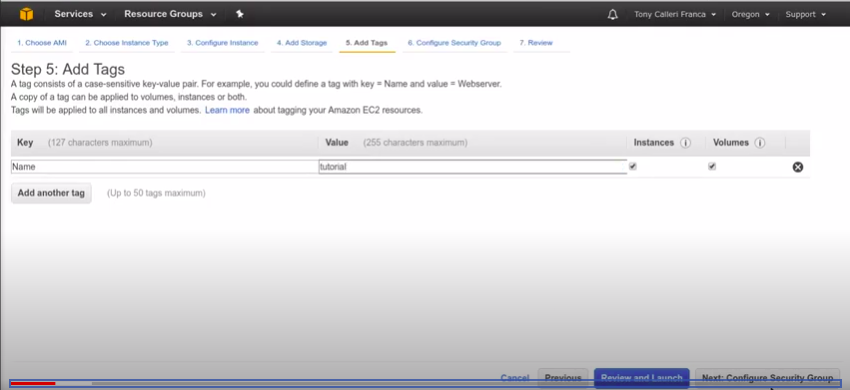

Select Launch

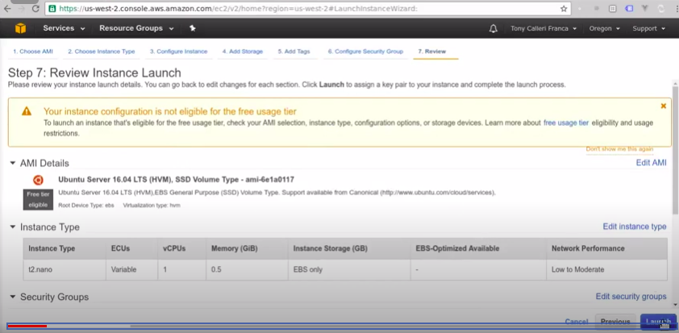

It's going to ask you about your key pair to access the machine. You will select "Create a new key pair" with "tutorial" name. Then select "Download key pair". A "tutorial.pem" will be downloaded. You can then launch the instance.

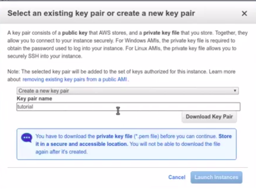

While the instance is being loaded. Move the tutorial.pem file to .ssh folder in root.

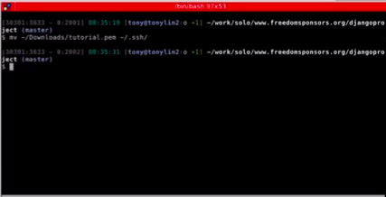

And then make it have the correct access rights. Check the actual access rights by command:

```
ll ~/.ssh/
```
The tutorial.pem file will have access rights as: "-rw-rw-r--". To fix it, run:

```
chmod 600 ~/.ssh/tutorial.pem
```

Now the access will be like: "-rw-------"

# Configure new machine

After the machine has been initialized, select it and get its public ipv4 dns, as shown below

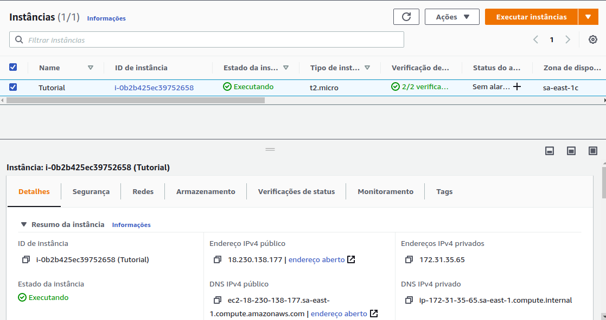

Go to the terminal and run:

```
ssh -i ~/.ssh/tutorial.pem ubuntu@ec2-18-228-189-166.sa-east-1.compute.amazonaws.com
```
## Configure machine so you don't need to inform key pair

In the machine, edit the file authorized_keys inside the ~/.ssh folder

```
nano ~/.ssh/authorized_keys
```

In this file, you will add you id_rsa.pub key value. If you don't have this file, you can generate it by running:

```
ssh-keygen -t rsa
```

if you already do, simply run

```
cat ~/.ssh/id_rsa.pub
```

copy its value and paste it on the last line of the authorized_keys file in the ec2 instance. Exit the ssh terminal and then you can ssh again by running only:

```
ssh ubuntu@ec2-18-228-189-166.sa-east-1.compute.amazonaws.com
```
## Configure swap

If you run the command:

```
free
```

You will notice the machine doesn't have a swap mechanism. It's bad because the instance is already small, so if our programs run out of resources it's over. By adding swap they can try to stay alive by using a the swap.

To learn how to add swap, one can access the digital ocean tutorial by searching "digitalocean add swap ubuntu" and follow the tutorial. Alternatively, you can follow:

https://github.com/tonylampada/randomstuff/blob/gh-pages/swap_digitalocean.sh

```
sudo su

swapon -s
free -m
df -h

fallocate -l 4G /swapfile
chmod 600 /swapfile
mkswap /swapfile
swapon /swapfile

echo /swapfile   none    swap    sw    0   0 >> /etc/fstab

cat /proc/sys/vm/swappiness
cat /proc/sys/vm/vfs_cache_pressure

sysctl vm.vfs_cache_pressure=50
sysctl vm.swappiness=10

echo vm.swappiness=10 >> /etc/sysctl.conf
echo vm.vfs_cache_pressure=50 >> /etc/sysctl.conf

echo ---------------------------------------------
swapon -s
free -m
cat /proc/sys/vm/swappiness
cat /proc/sys/vm/vfs_cache_pressure
cat /etc/fstab
```

## Configure docker

https://github.com/tonylampada/randomstuff/blob/gh-pages/install_docker_ubuntu.md

```
sudo apt-get install \
    apt-transport-https \
    ca-certificates \
    curl \
    software-properties-common

curl -fsSL https://download.docker.com/linux/ubuntu/gpg | sudo apt-key add -

sudo add-apt-repository \
   "deb [arch=amd64] https://download.docker.com/linux/ubuntu \
   $(lsb_release -cs) \
   stable"

sudo apt-get update
sudo apt-get install docker-ce

```

to test:

```
sudo docker run hello-world
```

to stop using sudo:

```
sudo usermod -aG docker ubuntu
```

Log out of the machine, connect again and test:

```
docker run hello-world
```

## Configure docker prune to run periodically

https://github.com/tonylampada/randomstuff/blob/gh-pages/docker_prune.sh


Docker prune file:

```
#!/bin/bash
docker system prune -f
docker volume prune -f
docker images -q --filter "dangling=true" | xargs -r docker rmi
```

Create the docker prune file

```
mkdir cron
cd cron/
touch docker_prune.sh
chmod +x docker_prune.sh
```
Edit the file and add the content as shown above

Now run:

```
crontab -e
```
Select nano and and paste in the last line:

```
0 0 * * * /home/ubuntu/cron/docker_prune.sh
```

After saving it, run:

```
crontab -l
```

to check if the scheduled cron is there.

# Make a image of this machine to user again

We don't want to configure all that all the time. So there is a way for us to create a image out of this process so we don't have to repeat ourselves.

Right click the instance -> image -> create image:

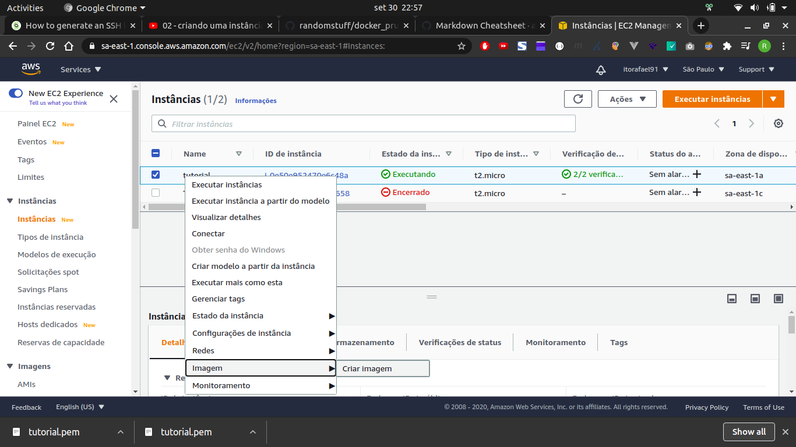

Give it a name and description (like 'swap_docker') and create it. I will be located at the Images -> AMIs menu on the left and will contain our images to create instances from

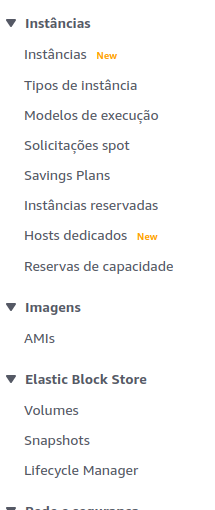

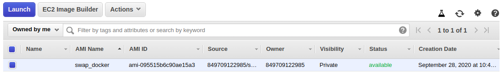