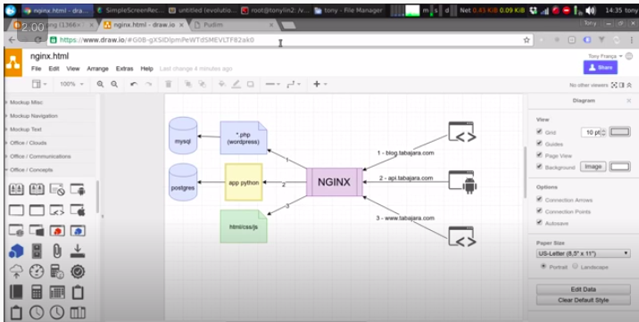
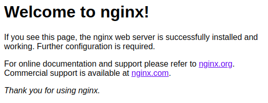
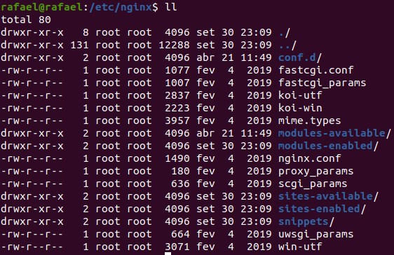

# Nginx

Nginx is a web server that can be used to serve web applications. Duh. So, you can use it to provide a static page on the web, such as www.pudim.com.br or you can use it to define a set of dns for the applications of your company, as in the diagram below:



Let's say that for that diagram we want to provide a website, an api and a wordpress blog. We can use nginx to make all those urls redirect to the specific applications that will provide the desired content.

# Getting started

So, first we can install nginx on our dev machine:

```
sudo apt-get install nginx
```

to see its process running, do:

```
ps -ef | grep nginx
```

and we can access it by: http://localhost



# Configuration files

Nginx configuration files are on /etc/nginx



The folders sites-available and sites-enabled are generally there. Usually the config files are located at sites-enabled, otherwise if the folder doesn't exist the config file are at "conf.d"

In our example, we would have 3 config files on sites-enabled one called "blog", other "api" and the last one "site".

When you access the sites enabled folder there is one default configuration file called "default". Removing the excessive comments, it has the following content:

```
server {
	listen 80 default_server;
	listen [::]:80 default_server;

	root /var/www/html; # 2

	index index.html index.htm index.nginx-debian.html; # 3
 
	server_name _;
	location / { # 1
		try_files $uri $uri/ =404;
	}
}

```
It basically says, "everytime you try to hit "/" url (1) look for its content in the /var/www/html folder (2) and look for the html files in the following order (3).

# First site example

Let's create a website called queijadinha:

```
cd /var/www
cp -Rf html queijadinha
cd queijadinha
mv index.nginx-debian.html index.html
nano index.html
# edit the "Welcome to nginx" to "Bem vindo ao queijadinha"
```

Now let's go back to nginx config files:

```
sudo su
cd /etc/nginx/sites-enabled
touch queijadinha.conf
nano queijadinha.conf
#edit as the section below
```

The file:
```
server {
	listen 80 default_server; # pay attention to this
	listen [::]:80 default_server; # pay attention to this

	root /var/www/queijadinha;

	index index.html index.htm;
 
	server_name queijadinha.com.br;
	location / {
		try_files $uri $uri/ =404;
	}
}
```

And run:
```
service nginx start
```

And... Fail. The error occurs:

> Job for nginx.service failed. See "systemctl status nginx.service" and "journalctl -xe" for details.

We can check the error at nginx logs. Located at:

```
cd /var/log/nginx/
tail -f error.log
```

We can see that the error was:

> 2020/09/30 23:36:26 [emerg] 35525#35525: a duplicate default server for 0.0.0.0:80 in /etc/nginx/sites-enabled/queijadinha.conf:2

We can remove the default server configuration of our new nginx file:

```
server {
	listen 80; # Removed default_server
	listen [::]:80; # Removed default_server

	root /var/www/queijadinha;

	index index.html index.htm;
 
	server_name queijadinha.com.br;
	location / {
		try_files $uri $uri/ =404;
	}
}
```

And then we can run in another terminal:

> sudo service nginx start

or 

> sudo service nginx reload
(The second when your server was already running)

And then we get the log:

>2020/09/30 23:42:52 [notice] 35966#35966: signal process started

Good. Nginx is okay. Now we can type in our browser the url http://queijadinha.com.br and it will work, right? No. Because we're looking at the internet and not at our local webserver. So, can we tell our computer to look for queijadinha url at our local ip? Yes. By editing hosts file

> sudo nano /etc/hosts

add the line

> 127.0.0.1 queijadinha.com.br

and now it will work:

> ping queijadinha.com.br

No we can access http://queijadinha.com.br

# Nginx proxy (center vale)

Now, lets make a proxy for the centervale website (www.centervale.com.br) from the domain http://biscoi.to 

Again, let's add to the hosts file the line:

> sudo nano /etc/hosts
> 127.0.0.1 biscoi.to

Lets create the nginx config file
```
cd /etc/nginx/sites-enabled
sudo cp queijadinha.conf biscoito.conf
sudo nano biscoito.conf
```

The content will be:

```
server {
	listen 80;
	listen [::]:80;

	index index.html index.htm;
 
	server_name biscoi.to;
	location / {
        proxy_set_header    Host $host;
        proxy_set_header    X-Real-IP $remote_addr;
        proxy_set_header    X-Forwarded-For $proxy_add_x_forwarded_for;
        proxy_set_header    X-Forwarded-Proto $scheme;
        proxy_pass          http://www.centervale.com.br;
	}
}
```

Andddd.... It does not work. Bad gateway-> The problem is that the web server that centervale doesn't like to be accessed as biscoi.to. So it shuts down the connection. To solve it change the host for centervale. Like:

```
server {
	listen 80;
	listen [::]:80;

	index index.html index.htm;
 
	server_name biscoi.to;
	location / {
        proxy_set_header    Host www.centervale.com.br;
        proxy_set_header    X-Real-IP $remote_addr;
        proxy_set_header    X-Forwarded-For $proxy_add_x_forwarded_for;
        proxy_set_header    X-Forwarded-Proto $scheme;
        proxy_pass          http://www.centervale.com.br;
	}
}
```

And voila:


To practice you can search google for "how to configure nginx proxy" and access one of digital ocean's tutorials and see more examples, such as more proxies and adding certificates and things like that