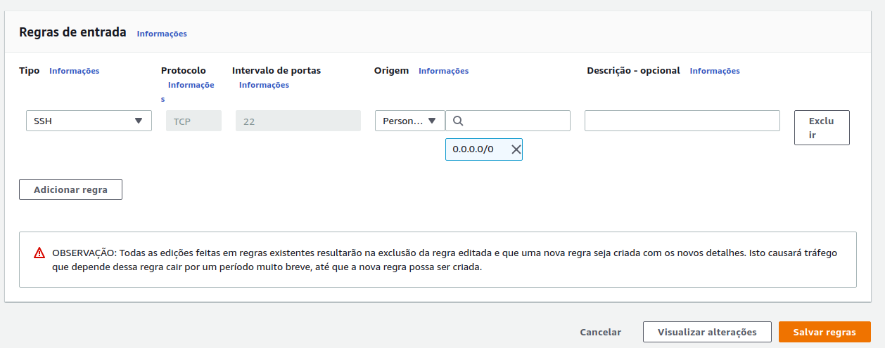

# Nginx on docker inside aws

Lets access our ec2 by ssh and run:

> docker run -d nginx

-d will unlock our terminal while nginx is running. Good, now we can test localhost by trying to wget it. Annnnd... There is a problem.


We didn't map our port 80 to the container, when we accessed the first time we were trying to access the ec2 instance port 80 and the port we want is from the container, so we mapped it by adding p parameter. And it worked: wget got the index.html file.

Now Lets try accessing by trying the instance dns.

http://ec2-18-228-189-166.sa-east-1.compute.amazonaws.com

Aaaaaannnnnnnnnnnd. It failed.


That's because we didn't configure our instance to open firewall exception for port 80. And we can do it by accessing the default created security group and adding the port 80 to it.

Select the security tab on the instance and check its security group


Then on the left menu access Network and security -> Security Groups


Select the security group, select the rule tab and select the editting button


Add a rule for the 80 port and also select origin 0.0.0.0 and ::0. Save it.



The rules will be added


And then nginx will be accessible by the public instance dns:


# Configuring Dockerized nginx

We will access its configuration files inside the container. In order to do so, execute:


Now copy content of default.conf, LEAVE THE CONTAINER, and execute:

```
mkdir -p dkdata/nginx/conf.d
touch default.conf
nano default.conf
# paste copied info
```

Now, lets do the following:


What did we do? We created a docker volume that contains the configuration file of nginx. The file will be outside the container so we can configure nginx without having to access the container directly.

You can create on the root a dknginx.sh file that will do the long command we just used.

```
docker stop nginx
docker rm nginx
docker run -d --restart=unless-stopped \
        --name=nginx -p 80:80 \
        -v /home/ubuntu/dkdata/nginx/conf.d:/etc/nginx/conf.d \
        nginx
```

Dont forget to chmod +x it and run.

